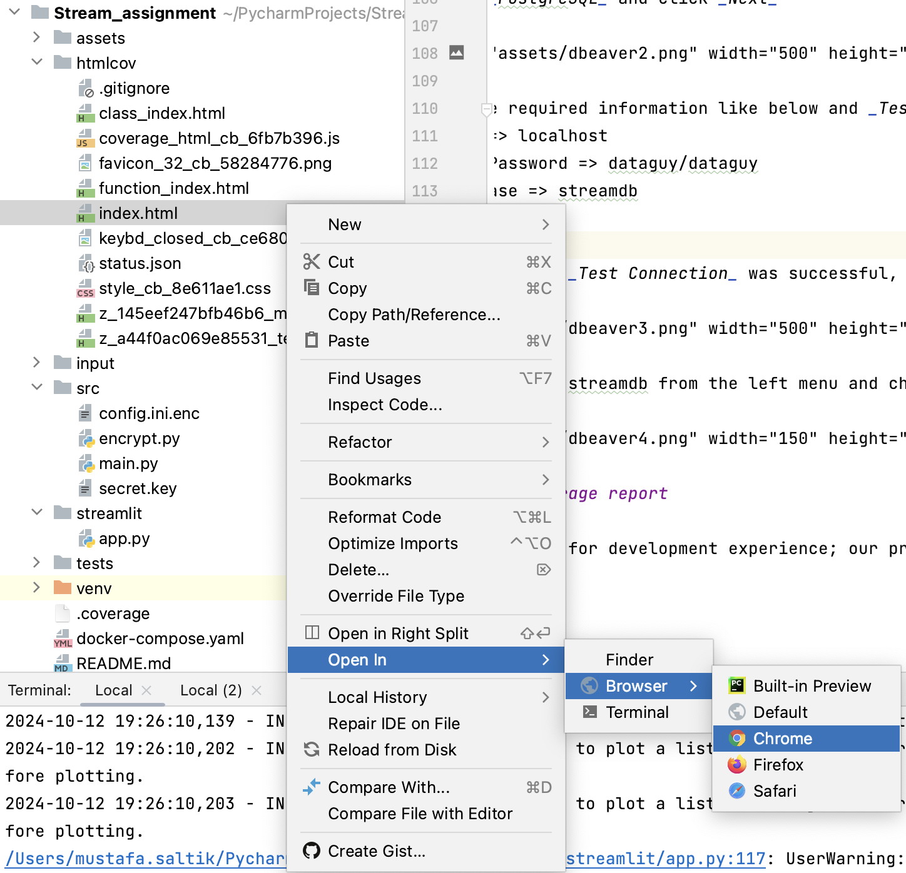
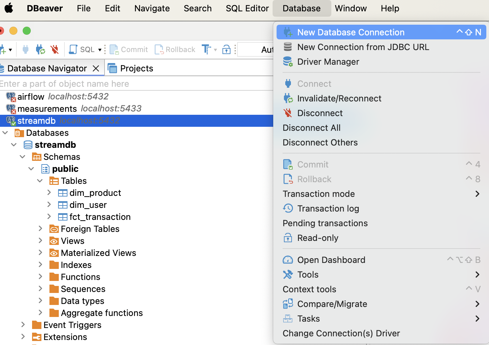
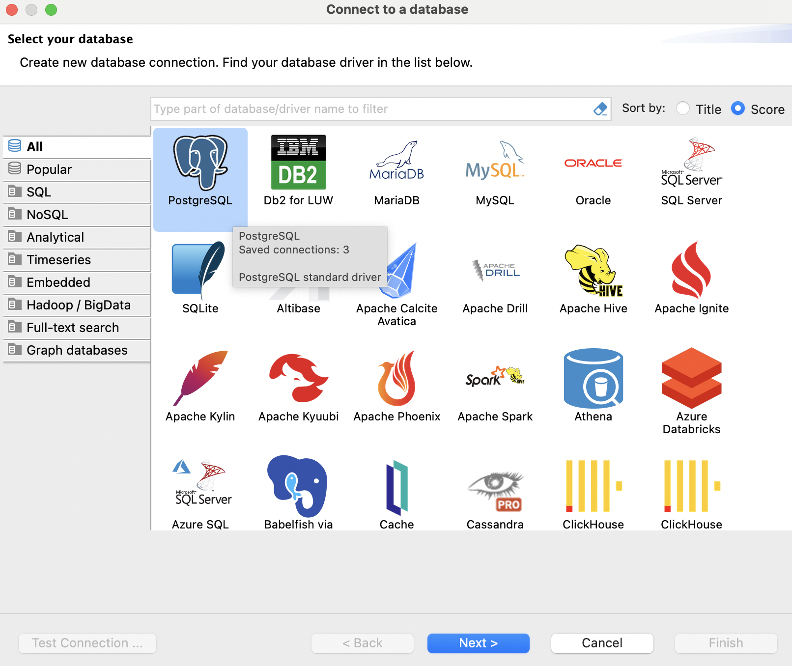
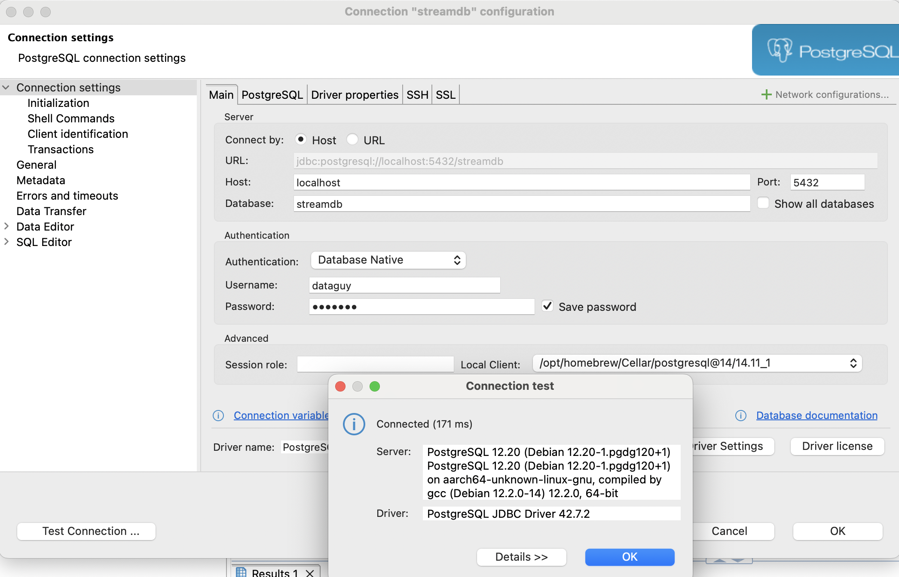
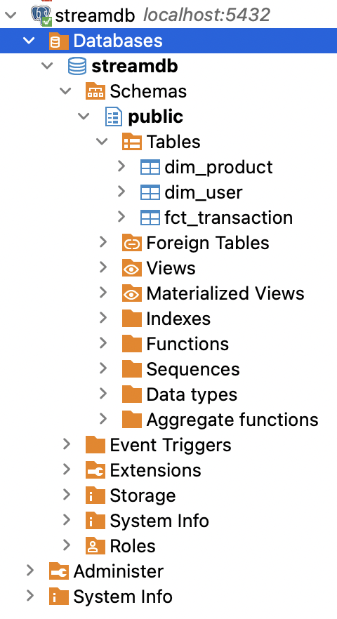
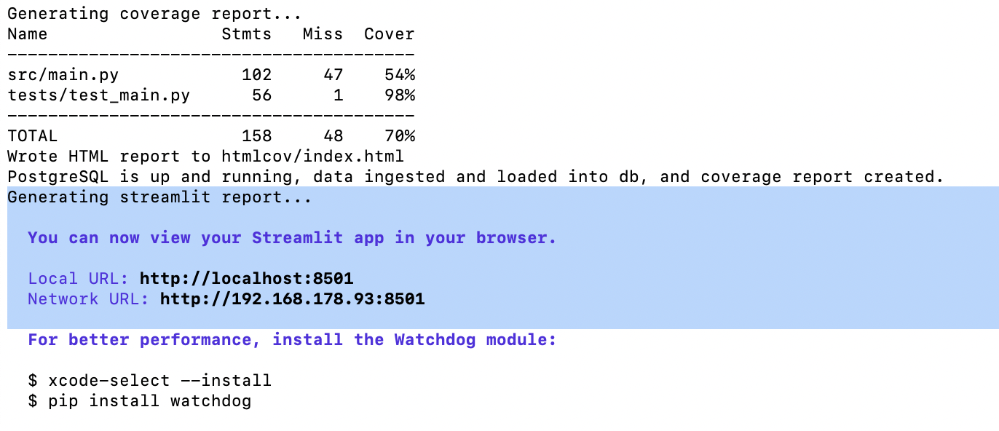
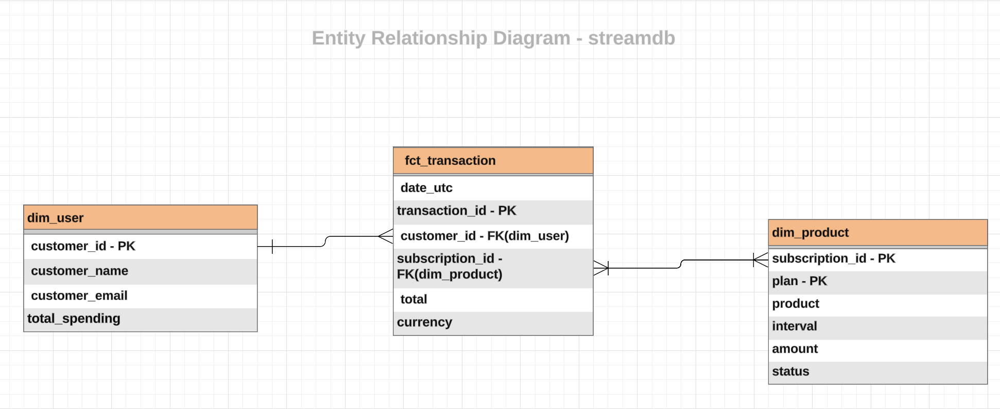
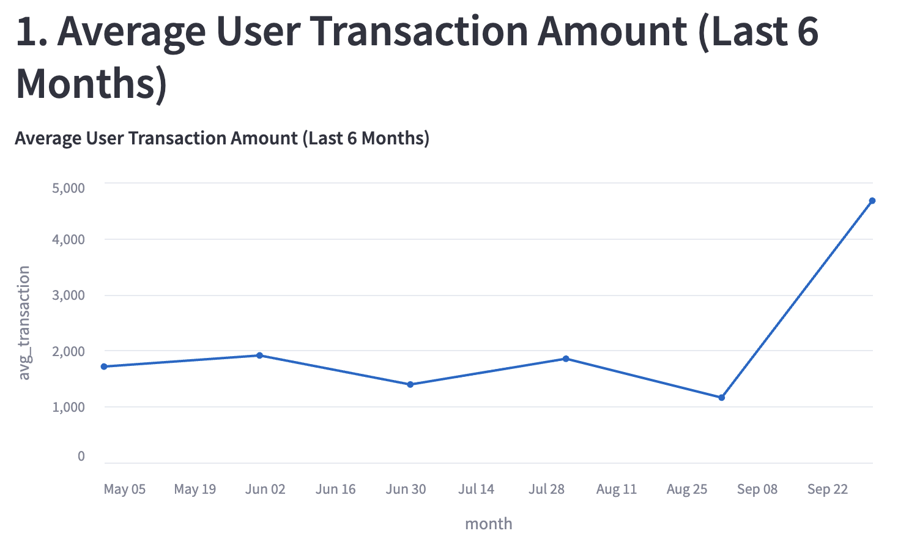
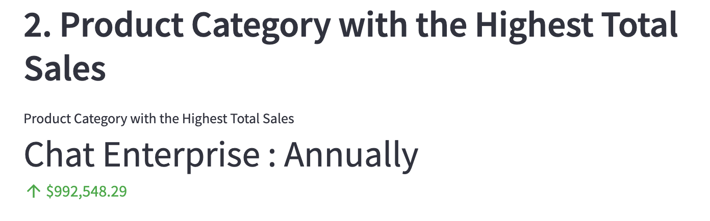
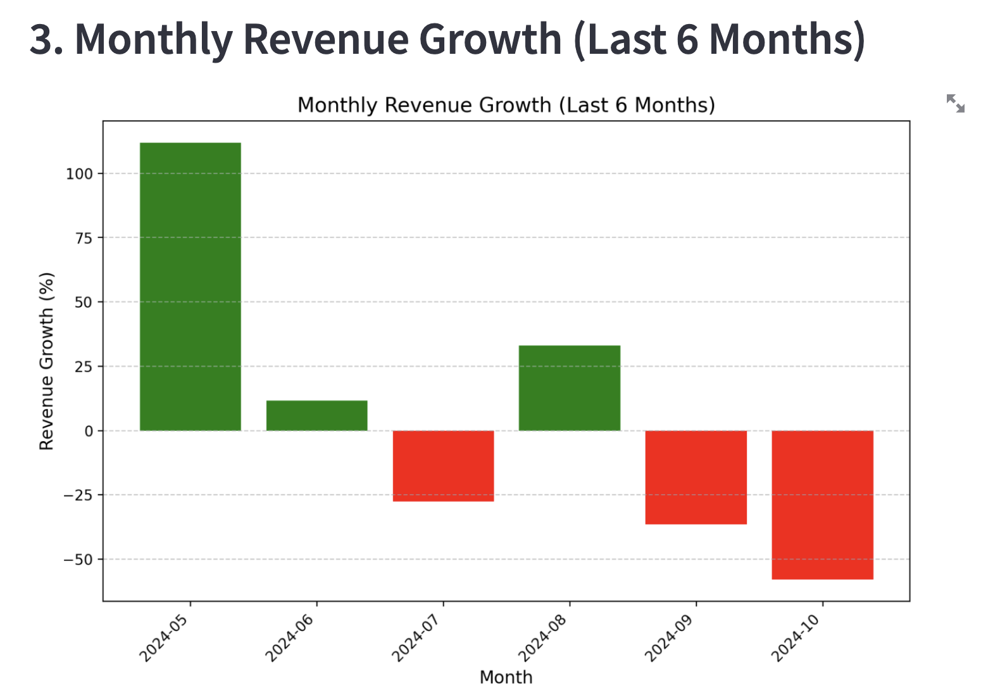

# Assignment - Senior Data Engineer

This project is a data analytics platform that utilizes **Streamlit** for visualizations and **PostgreSQL** as the database backend. It covers the analysis of transaction data, including average user transactions, monthly revenue growth, and product sales.

## Table of Contents

- [Project Overview](#project-overview)
- [Features](#features)
- [Prerequisites](#prerequisites)
- [Setup and Installation](#setup-and-installation)
- [Run the project](#2-run-the-project)
- [Testing and Test Coverage](#3-test-coverage-report)
- [Check the data from PostgreSQL](#4-check-the-data-from-postgresql)
- [Streamlit report](#5-streamlit-report)
- [Assignment tasks](#assignment-tasks)
- [Data Ingestion](#data-ingestion)
- [Data Transformation](#data-transformation)
- [Data Loading](#data-loading)
- [Optimization and Analysis](#optimization-and-analysis)
- [Generate a Performance Report (Streamlit App)](#generate-a-performance-report--streamlit-app-)
- [Finally](#finally)


## Project Overview

The project ingests data from multiple files, processes them, and stores the results in a PostgreSQL database. The platform uses **Streamlit** to generate insightful reports.

### Features

- **Streamlit Dashboard**:
  - Interactive visualizations, including:
    - Average User Transaction Amount (Last 6 Months)
    - Product Category with the Highest Total Sales
    - Monthly Revenue Growth (Last 6 Months), with declines highlighted.

- **PostgreSQL Database**: Stores cleaned and processed data.
- **Test Coverage**: Full test coverage using Python's `unittest` and `coverage`.
- **Encryption logic for database information**: Utilise encryption to protect database information in the code base. Currently ```src/secret.key``` file is in the project folder just for demo. It should be moved into secret manager in any production environment.

## Prerequisites

To run the project, make sure you have the following installed:

- Python 3.8+
- Docker & Docker Compose (for PostgreSQL setup)

Python dependencies are listed in `requirements.txt`.

## Setup and Installation

### 1. Unzip the project

Once you unzip the project, you will see the project files with the below structure.
```
Stream_assignment/
│
├── assets/                      # Pictures used for documentation
│   ├── ...
├── htmlcov/                     # Unit test coverage report
│   ├── ...
├── input/                       # Files contain input data
│   ├── products.csv
│   ├── transactions.csv
│   ├── users.csv
├── src/
│   ├── config.ini.enc           # Encrypted configuration file
│   ├── encrypt.py               # Script for encryption
│   ├── main.py                  # Core logic for data ingestion and processing
│   ├── secret.key               # Encryption key
├── streamlit/
│   ├── app.py                   # Streamlit app for data visualization
├── tests/
│   ├── test_main.py             # Unit tests
├── venv/                        # Auto-generated folder for virtual python environment
│   ├── ...
├── .coverage                    # Auto-generated metadata file for unit test coverage report
├── docker-compose.yaml          # Docker configuration for PostgreSQL
├── README.md                    # Documentation (this file)
├── requirements.in              # Input file for Python dependencies
├── requirements.txt             # Auto-generated dependencies list with specific versions
└── run_project.sh               # Shell script to automate running the project
```

### 2. Run the project

I've prepared ```run_project.sh``` file for you to easily set the project up. 

- Open the terminal and go to project folder
  - ```cd Stream_assignment/```
- Activate virtual environment
  - ```source venv/bin/activate```
- Type below and enter!
  - ```./run_project.sh```

It can take a minute if you don't have dependencies available in your local environment. After first run, this process takes only 2 seconds to complete.

I suggest you to have a look the logs to have an idea about what is happening when you run ```run_project.sh```, it basically makes everything ready to check.
- Setting up PostgreSQL with Docker
- Installing all the required libraries from requirements files
- Running the ETL to ingest, process and load the data
- Running unit tests and prepare a coverage report to see the code coverage and which parts of the code has been tested and which parts we need to add more unit tests
- And finally runs the streamlit application to visualize reports

### 3. Test coverage report

As best practise for developer experience; our project includes unit tests and a report to make test results visible for everyone in the team. It shows which parts of our project are being checked by unit tests and the percentage of test coverage. In a production project; it's good practice to set test coverage like 70-80% minimum so that no one can deploy any change without adding unit tests. You can open the report from ```htmlcov/index.html``` in a browser or Python built-in preview.



### 4. Check the data from PostgreSQL

To be able to query data from a database, I used Dbeaver Community Edition. Any other _database query editor_ can be used for this but if you would like to use Dbeaver, you can download it from [here](https://dbeaver.io/download/).

#### 4.1 Connect to Streamdb from Dbeaver

Once you run the project in the 2nd step; it should set up _streamdb_ already. Follow the steps to connect:
- Click _New Database Connection_ from the menu under _Database_ tab



- Choose _PostgreSQL_ and click _Next_



- Fill the required information like below and _Test Connection_
  - Host => localhost
  - User/Password => dataguy/dataguy
  - Database => streamdb
  - Port => 5432

Once you see the _Test Connection_ was successful, click _OK_ for both windows. You are ready to query streamdb!



You can open the streamdb from the left menu and check the tables which were loaded by 2nd step.



### 5. Streamlit report

Once you run ```run_project.sh``` in the 2nd step; you can see the url to Streamlit report in logs like below:



The url you see in the logs should be similar with this one(It may change according to port usage in your computer): http://localhost:8501

## Assignment tasks

### Data Ingestion

- Each input file has been processed and ingested by ```ingest_data``` function. This function have calls to other functions to deduplicate data and transform date fields.

### Data Transformation

I have added details about where I implemented the requirement in the code base. Each function has its own docstring in the code base with more details like input, output and what it is doing.
- **Standardize date formats**: Dates have been modified to the standard timestamp format using ```convert_date_format``` function.
- **Handle missing or duplicate records**: Each data points have been deduplicated using ```remove_duplicates``` function.
- **Create a relational schema by establishing primary and foreign keys**



- **Calculate total spending per user**: Total spending is calculated by ```calculate_total_spending_per_user``` function per user. And it's added into dim_user dimension table as a new field for dimensional modelling.

### Data Loading

- **Load into PostgreSQL**: Each data points have been loaded into PostgreSQL database by ```save_to_postgres``` function.

As an example log; our process is checking duplicates and removing it before any calculation or loading into database.
```
INFO - Removed 0 duplicate rows from products_df. Remaining rows: 460
INFO - Removed 0 duplicate rows from transactions_df. Remaining rows: 12870
INFO - Removed 10888 duplicate rows from users_df. Remaining rows: 1982
```

### Optimization and Analysis
- **Top 5 users by total transaction amount**:
```
WITH ranked_data AS (
SELECT
	customer_id
	,total_spending
	,ROW_NUMBER() OVER(PARTITION BY customer_id ORDER BY customer_name, total_spending DESC) AS rn
FROM
	dim_user du
)
SELECT
	customer_id,
	total_spending
FROM
	ranked_data
WHERE
	rn = 1
ORDER BY
	total_spending DESC
LIMIT 5;
```

- **Product category with the highest total sales**:
```
SELECT
	dp.product
	,sum(ft.total) AS total_sales
FROM
	fct_transaction ft
INNER JOIN dim_product dp 
		ON ft.subscription_id = dp.subscription_id
GROUP BY
	product
ORDER BY
	total_sales DESC
LIMIT 1;
```

- **Monthly revenue growth for the last 6 months**:
```
WITH monthly_revenue AS (
    SELECT 
        DATE_TRUNC('month', date_utc) AS month,
        SUM(total) AS monthly_revenue
    FROM 
        fct_transaction
    WHERE 
        date_utc >= NOW() - interval '6 months'
    GROUP BY 
        month
    ORDER BY 
        month
)
SELECT
    month,
    monthly_revenue,
    LAG(monthly_revenue) OVER (ORDER BY month) AS prev_month_revenue,
    CASE
        WHEN LAG(monthly_revenue) OVER (ORDER BY month) IS NOT NULL
        THEN TO_CHAR(((monthly_revenue - LAG(monthly_revenue) OVER (ORDER BY month)) / LAG(monthly_revenue) OVER (ORDER BY month)) * 100, 'FM999999.00') || ' %'
        ELSE '0.00 %'
    END AS revenue_growth
FROM
    monthly_revenue
ORDER BY month DESC
LIMIT 6;
```

### Generate a Performance Report (Streamlit App)

- **Clean and transform the data as necessary, ensuring that user_id links the users to their transactions and products**:
Data Quality checks:
  - Data consistency check between customers and transactions 
    - total_count_of_cust_in_fct_notIn_dim: Shows total count of customers who have trx but don't exist in user dimension 
      - 0 means that each trx have their users in user dimension
    - total_count_of_cust_in_dim_notIn_fct: Shows total count of customers who exist in user dimension but don't have any trx (might be normal)
      - 0 means that each user have their trx in fact table
  ```
  SELECT
      sum(CASE WHEN du.customer_id IS NULL THEN 1 ELSE 0 END) 
            AS total_count_of_cust_in_fct_notIn_dim
      ,
        sum(CASE WHEN ft.customer_id IS NULL THEN 1 ELSE 0 END) 
            AS total_count_of_cust_in_dim_notIn_fct
  FROM
      dim_user du
  FULL OUTER JOIN fct_transaction ft
          USING(customer_id);
  ```
  - Data consistency check between customers and transactions and products. 2 main parts we are checking here:
    - Data quality checks for null subscriptions in the fact table 
      - total_count_of_trx_have_null_subsId: Shows total count of trx don't have a valid subscription id in fact table 
      - result: 1699 trx has null subscription id. A data quality problem which needs to be reported. 
      - these trx are belong to 303 customers which can be seen in total_count_of_customer_have_null_subsId_in_fact field. 
      - total amount of these trx is ~4M USD, and we can't see from which products it comes from!!
    - Data quality checks for subscriptions which exist in fact but can't be found in dimension 
      - total_count_of_trx_have_subsID_notIn_productDim: Shows total count of trx have subscription id in fact table, but it doesn't exist in the product dimension. 
      - result: 12043 trx have subscription id in fact table but those subscriptions don't exist in the product dimension. A data quality problem which needs to be reported. 
      - these trx are belong to 1336 customers which can be seen in total_count_of_customer_have_subsID_inFact_notIn_productDim field. 
      - total amount of these trx is ~22M USD (+ ~5K eur) and we can't see from which products it comes from!!
  ```
  SELECT 
      sum(CASE WHEN ft.subscription_id IS NULL THEN 1 ELSE 0 
          END) AS total_count_of_trx_have_null_subsId
      ,
      count(DISTINCT CASE WHEN ft.subscription_id IS NULL THEN ft.customer_id ELSE NULL 
            END) AS total_count_of_customer_have_null_subsId_in_fact
      ,
      sum(CASE WHEN ft.subscription_id IS NULL AND ft.currency = 'usd' 
              THEN ft.total ELSE 0  
          END) AS total_amount_from_unknown_sunscriptions_usd
      ,
      sum(CASE WHEN ft.subscription_id IS NULL AND ft.currency = 'eur' 
              THEN ft.total ELSE 0  
          END) AS total_amount_from_unknown_sunscriptions_eur
      ,
      sum(CASE WHEN ft.subscription_id IS NOT NULL 
                  AND dp.subscription_id IS NULL
                  THEN 1 ELSE 0 
          END) AS total_count_of_trx_have_subsID_notIn_productDim
      ,
      count(DISTINCT CASE WHEN ft.subscription_id IS NOT NULL 
                          AND dp.subscription_id IS NULL
                          THEN ft.customer_id ELSE NULL 
                     END) AS total_count_of_customer_have_subsID_inFact_notIn_productDim
      ,
      sum(CASE WHEN ft.subscription_id IS NOT NULL AND ft.currency = 'usd'
                  AND dp.subscription_id IS NULL
                  THEN ft.total ELSE 0 
          END) AS total_amount_from_unknown_products_usd
      ,
      sum(CASE WHEN ft.subscription_id IS NOT NULL AND ft.currency = 'eur'
                  AND dp.subscription_id IS NULL
                  THEN ft.total ELSE 0 
          END) AS total_amount_from_unknown_products_eur
  FROM
      dim_user du
  INNER JOIN fct_transaction ft
          USING(customer_id)
  LEFT JOIN dim_product dp
          USING(subscription_id)
  ```
  
- **Performance Report**
  - Average User Transaction Amount for the Last 6 Months
  
  

  - Product Category with the Highest Total Sales
  
  

  - Monthly Revenue Growth for the Last 6 Months

  


You can also visit http://localhost:8501 to see streamlit report on live!

### Finally

Don't forget to release all the resources by stopping streamlit application and docker container!

- Go to your terminal which you run the ```run_project.sh``` file and press _ctrl + C_ . This will kill the process and streamlit app will stop. It will also allow ```run_project.sh``` to remove docker containers which is the last step before quit.
- Done!